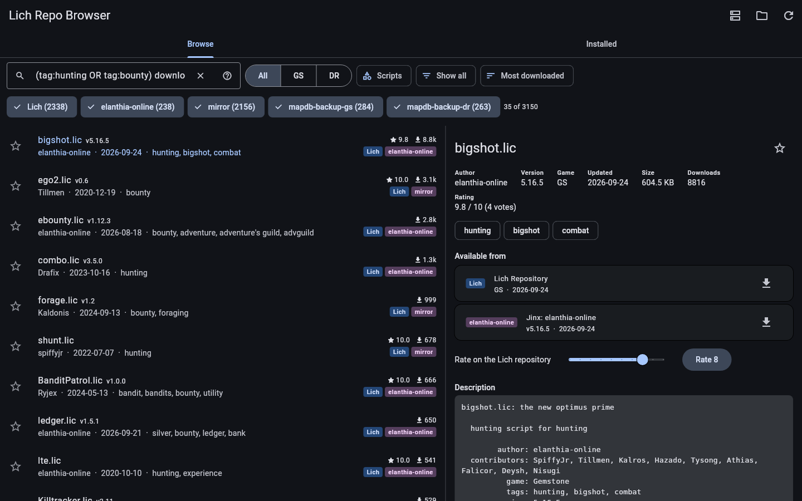
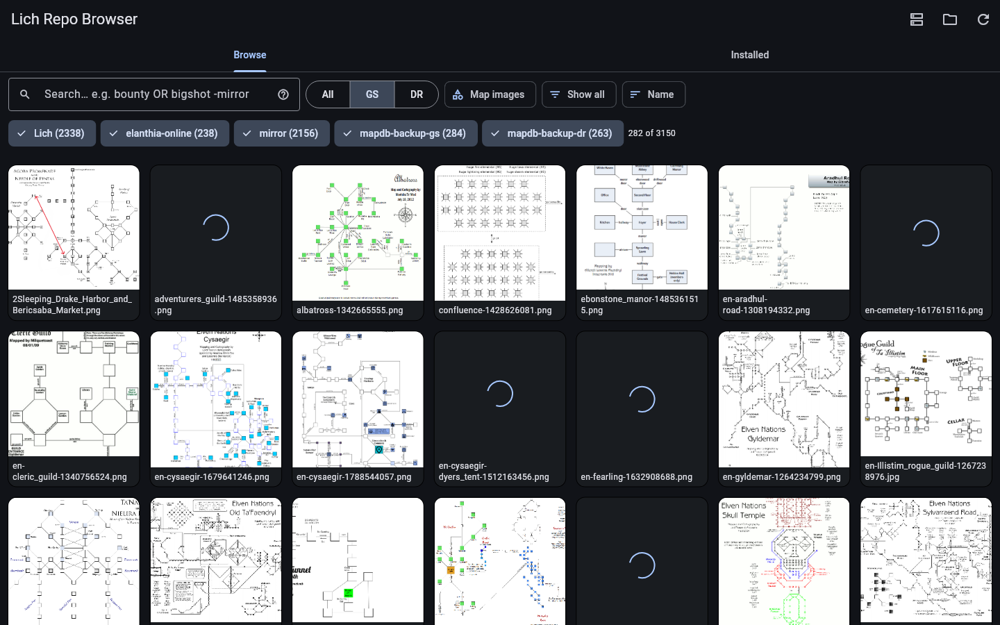

<p align="center">
  
</p>

# Lich Repo Browser

An unofficial, cross-platform browser for Lich scripts, covering both the `;repository`
server and Jinx repos, for Windows, macOS and Linux (Android/iOS builds are set up but
untested). Browse, search and download scripts without logging in to the game.





## Install

Download the latest build for your system from
[Releases](https://github.com/Lillymara/lich-repo-browser/releases):

- **Windows:** unzip `lich-repo-browser-windows-x64.zip` anywhere and run
  `lich_repo_browser.exe`. SmartScreen may warn about an unsigned app: "More info" → "Run anyway".
- **macOS:** unzip and move **Lich Repo Browser.app** to Applications. The first time,
  right-click it → Open (it isn't signed by Apple).
- **Linux:** extract `lich-repo-browser-linux-x64.tar.gz` somewhere permanent (for example
  `~/.local/opt/lich-repo-browser`), then run `./install-desktop-entry.sh` in that folder to add it
  to your applications menu with its icon. Or run `./lich_repo_browser` directly.

The app finds a Lich install in the usual places (e.g. `~/Lich5`, `C:\Lich5`); otherwise use the
folder button to choose it.

## Features

- One list across the Lich repository and Jinx repos (the same file from several sources shows once)
- Boolean search: `AND`/`OR`/`NOT` (`&` `|` `-` `!`), parentheses, `"phrases"`, fields
  (`author:` `tag:` `name:` `comment:` `source:` `game:` `type:` `version:` `is:`), wildcards,
  and `downloads:` `rating:` `votes:` `size:` `updated:` `age:` comparisons (`?` in the search box)
- Favorites, "new & updated since last visit", installed / update-available filters
- Downloads to the right Lich folder (`scripts/`, `data/`, `maps/`); replaced files are backed up
  to `<lich>/temp/repo-browser-backups/`
- Installed tab: which local files have updates, with per-file and bulk update
- Rate Lich repository scripts (1–10), add your own Jinx repos, browse map images in a gallery
- Catalogs cached for instant, offline-capable startup; phones save via the share sheet

## Layout

- `core/` — pure Dart package with the protocol clients (used by the app)
  - `lib/src/lich_repo_source.dart` — `;repository` server (TLS on `repo.lichproject.org:7157`)
  - `lib/src/jinx_source.dart` — Jinx repos (`<repo>/manifest.json` over HTTPS)
  - `lib/src/cert_check.dart` — verifies the Lich server cert against the pinned CA
  - `bin/spike.dart` — command-line tool that exercises both
- `app/` — Flutter GUI for Windows / macOS / Linux / Android / iOS

## Running the spike

Requires the Flutter SDK (includes Dart); here it lives in `~/development/flutter`.

```bash
cd core
dart pub get
dart run bin/spike.dart list bigshot            # search every source
dart run bin/spike.dart list --source jinx      # only Jinx repos
dart run bin/spike.dart info bigshot.lic --source lich
dart run bin/spike.dart download bigshot.lic --out /tmp
dart test
```

## Building the apps

Flutter can't cross-compile: Windows builds need Windows, macOS builds need a Mac with Xcode.

**Automatically (GitHub Actions).** `.github/workflows/build.yml` runs the tests, then builds on
GitHub's Linux, Windows and macOS machines. Each run's downloads are under the run's
*Artifacts*; pushing a tag such as `v1.0.0` also publishes them as a GitHub Release:

```bash
git tag v1.0.0
git push origin v1.0.0
```

**By hand** (Flutter installed on that machine), from `app/`:

| Platform | Command | Output |
|---|---|---|
| Linux | `flutter build linux --release` | `build/linux/x64/release/bundle/` (needs `clang cmake ninja-build libgtk-3-dev`) |
| Windows | `flutter build windows --release` | `build\windows\x64\runner\Release\` (needs Visual Studio with "Desktop development with C++") |
| macOS | `flutter build macos --release` | `build/macos/Build/Products/Release/Lich Repo Browser.app` (needs Xcode) |

App icons come from `assets/icon/app_icon.svg` (other design options are in
`assets/icon-options/`). After changing it, re-render the PNG masters and run
`dart run flutter_launcher_icons` in `app/`; the Windows `.ico` and Linux PNG are made separately
(see the comment in `app/pubspec.yaml`).

README screenshots are rendered off-screen at 1440×900 with live data:
`SCREENSHOTS_OUT=../docs flutter test test/readme_screenshots_test.dart` (from `app/`).

The builds are **unsigned**. Windows SmartScreen may warn ("More info" → "Run anyway"); on macOS,
right-click the app → Open the first time. Signing needs a code-signing certificate (Windows) or
an Apple Developer account (macOS, $99/year).

The macOS app is not sandboxed, because it reads and writes an existing Lich folder
(e.g. `~/Lich5`), which a sandboxed app can't reach. That's fine outside the Mac App Store.

## Protocol notes (learned from repository.lic / jinx.lic and live testing)

**Lich repository** (`;repository`)
- One TLS connection per request. The request is a single line of `key\tvalue\t...`;
  the response is a header line like that, followed by `size` bytes (gzip if `compression gzip`).
- The server cert (CN `Lich Repository`, no SAN) is signed by a private root CA embedded in
  repository.lic. Dart's hostname check always rejects it, so `onBadCertificate` re-verifies
  the RSA signature against the pinned CA, the validity dates and the CN.
- `list` columns: `file, game, size, last update, author, downloads, rating total, rating count, tags`.
- `list-comments`: `file, game, comments`, where `\x14` means tab and `\x12` means newline.
- `inspect` returns `versions` (`;`-separated, older versions only) and usually an empty body,
  so the detail view falls back to the script's own `=begin`/`=end` header.
- `rate` (`file`, `game`, `rating` 1–10) answers with a header only: `success` or `error`.
- The server rate-limits connections (resets after roughly a dozen in quick succession), so
  the app never makes per-file requests in bulk; update checks use the list's sizes instead.
- The client sends `client 2.74` (the repository.lic version). Check with the maintainers
  whether a third-party client should identify itself differently.

**Jinx**
- Default repos: `extras.repo.elanthia.online`, `ffnglichrepoarchive.netlify.app`,
  `elanthia-online.github.io/mapdb-backup-{gs,dr}`.
- `manifest.json` → `available[]` with `file, type, md5, last_commit, header, tags, version, author`.
- Despite its name, `md5` is a **base64 SHA-1** of the file.
- The `mirror` repo is an archive: every `last_commit` is the snapshot date (2020-12-19), so the
  app never treats it as the newest copy of a file available elsewhere.
- No CORS headers, so a plain web build can't read these without a proxy.
